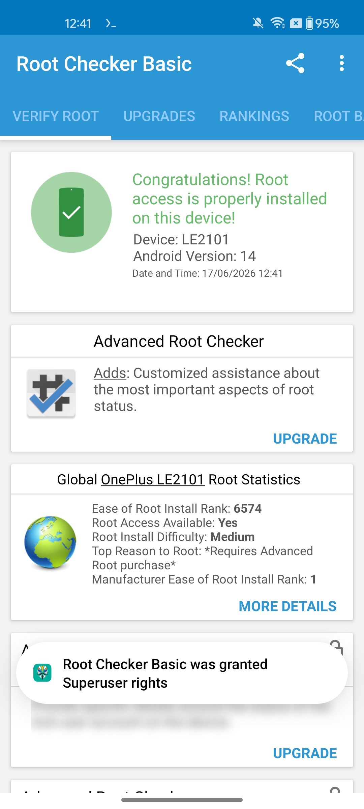
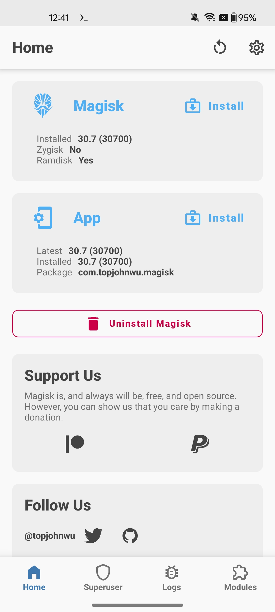
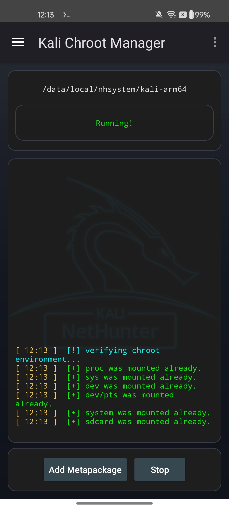
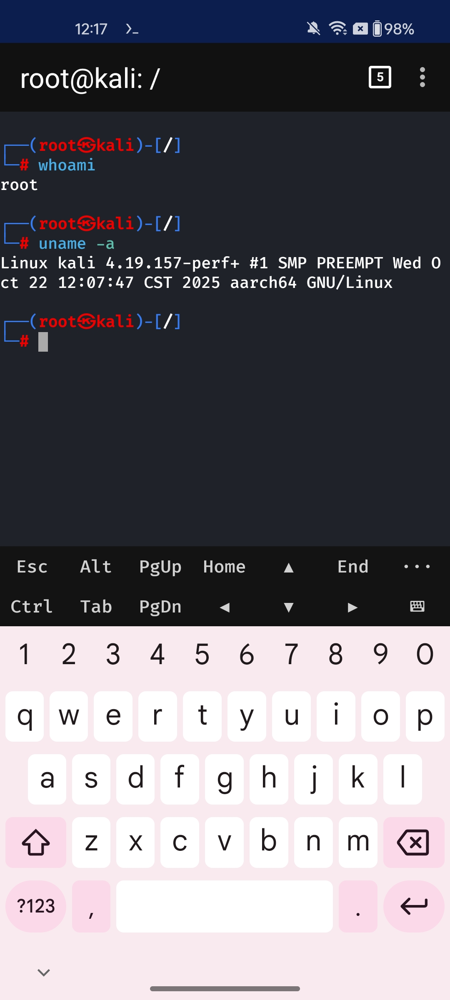
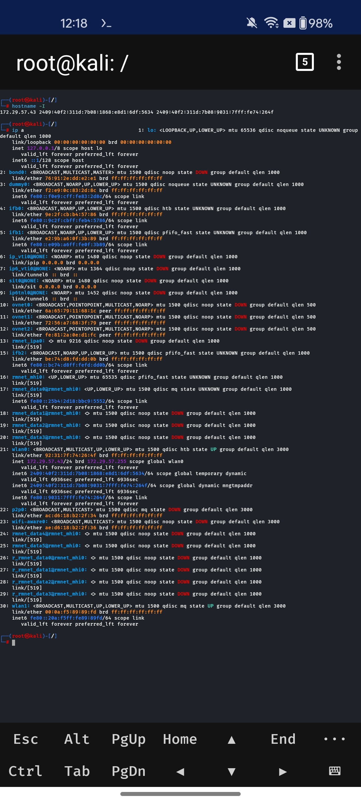
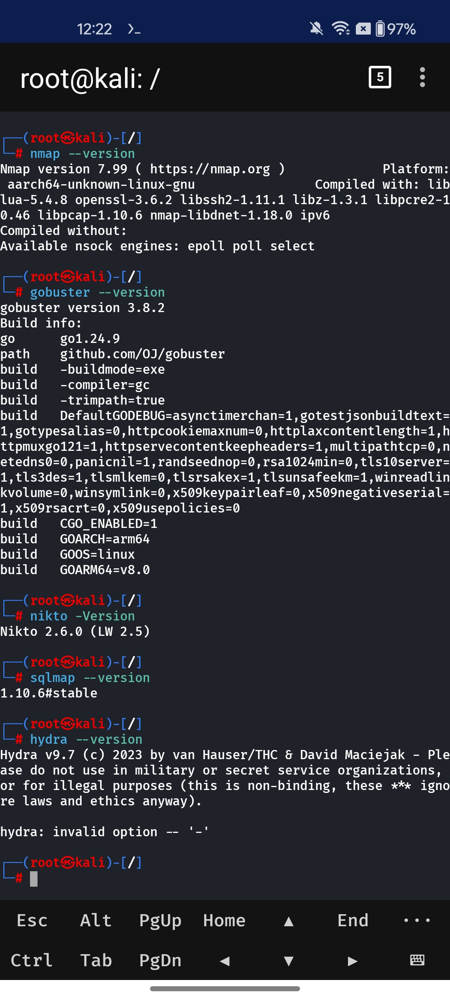
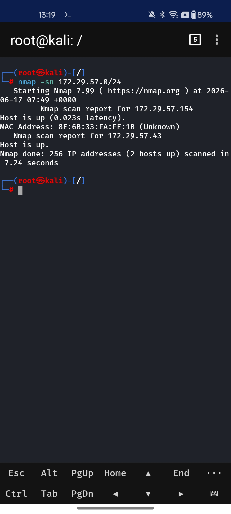
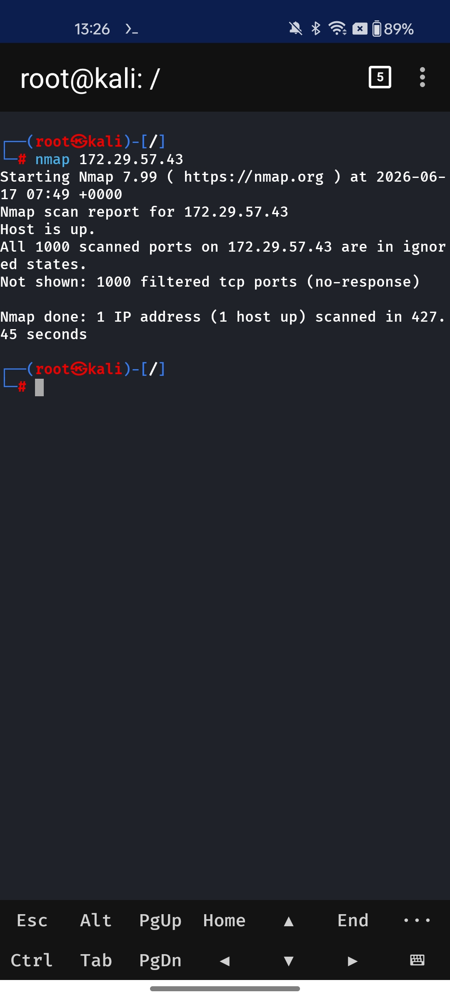
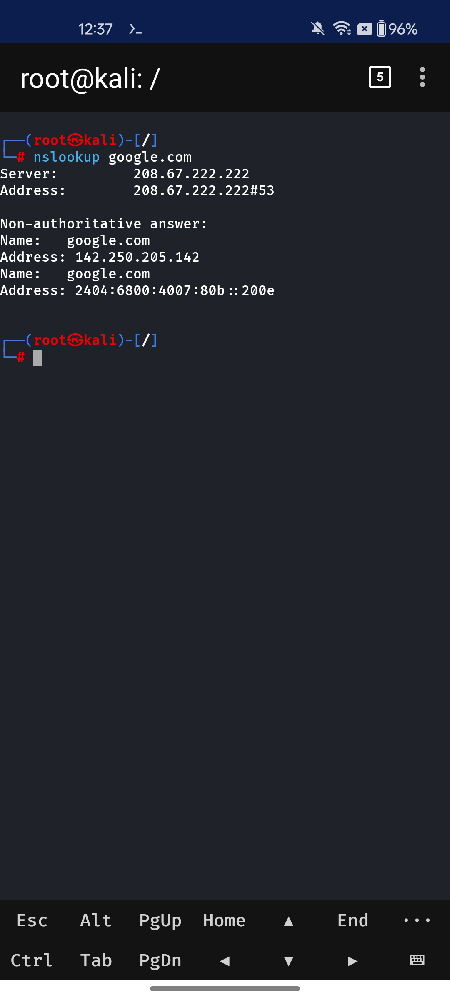
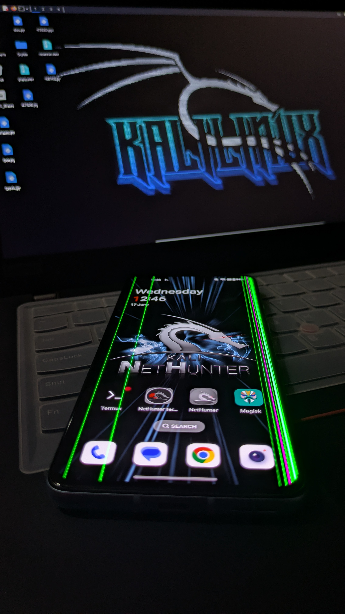

# Kali NetHunter Mobile Lab

## Overview

This project demonstrates a Mobile Penetration Testing Lab built using Kali NetHunter on a rooted Android device. The lab is used for learning networking, security assessment, reconnaissance, enumeration, and penetration testing fundamentals in a controlled environment.

## Device Information

| Component | Details |
|------------|------------|
| Device | OnePlus Nord CE 2 Lite (LE2101) |
| Android Version | Android 14 |
| Root Solution | Magisk 30.7 |
| Environment | Kali NetHunter Rooted |
| Architecture | ARM64 |

## Objectives

- Build a mobile penetration testing environment
- Configure Kali NetHunter on Android
- Verify root access and Linux environment
- Perform network reconnaissance
- Conduct host discovery
- Perform DNS enumeration
- Validate security tools installation
- Create a portable cybersecurity lab

## Tools Used

- Kali NetHunter
- Magisk
- Nmap
- Gobuster
- Nikto
- SQLMap
- Hydra
- NetHunter Terminal
- DNS Utilities

---

# Screenshots

## 1.Root Access Verified.jpeg



## 2. Magisk Root Management



## 3. Kali NetHunter Home Screen


## 4. Kali Chroot Manager



## 5. Root Shell Verification



```bash
whoami
uname -a
```

## 6. Network Configuration Analysis



```bash
hostname -I
ip a
```

## 7. Security Tools Verification



```bash
nmap --version
gobuster --version
nikto -Version
sqlmap --version
hydra -h
```

## 8. Network Host Discovery



```bash
nmap -sn 172.29.57.0/24
```

## 9. Port Scanning Demonstration



```bash
nmap 172.29.57.43
```

## 10. DNS Lookup Verification



```bash
nslookup google.com
```

## 11. Lab Setup


---

## Skills Demonstrated

- Linux Administration
- Android Rooting
- Kali NetHunter Configuration
- Network Reconnaissance
- Host Discovery
- Port Scanning
- DNS Enumeration
- Cybersecurity Lab Setup
- Penetration Testing Fundamentals

## Disclaimer

This project was created for educational and authorized security testing purposes only. All testing was performed in a controlled environment.

## Author

Manoj 
Cybersecurity Enthusiast
